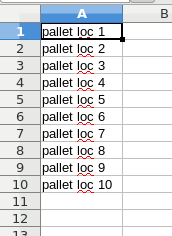

Warehouse Management
====================

Adding Pallet and Picking Locations
-----------------------------------

To manage warehouse picking and pallet locations, go to *Admin>Manage Warehouses* then select the warehouse you would like to add locations to. The warehouse must me a B&M to add picking and pallet locations.

There are two ways to add picking and pallet locations:

1- You can add each location manually.

2- You can bulk load locations

The bulk load requires a .csv file. Each location in Column A will recieve it's own cell. Do not add headers to the file.

If there are duplicates in the file, or duplicates of locations in the database, the duplicates will be ignored while the new locations will be added.

Example of a valid .csv file:

